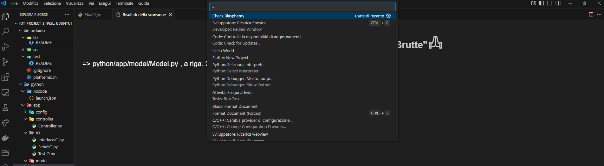

# Blasphemy Detector

This extension can be used to check the the code based for "Bad Words" (Heresy) in the code base.
It's just to be extra correct, but you will never know what's inside the code and if you don't want to make a mess you *MUST* run the following command:

### Blasphemy Finder

This feature represents the core of the extension, which consists of a vs code command that scatter thought the entire vs code project and finds all the Blasphemous works scatter in the code base.
"Check Blasphemy" creates a new page in the editor which consists of a list, in each element is present the file and the row, if clicked the item will take the user to the exact file and row that has been blasphemous.

## Requirements

- npm 

### 1.0.0

Initial release of Blasphemy Detector:
- implemented the key feature: the Blasphemy finder with a dedicated view.

---

**Enjoy!**
